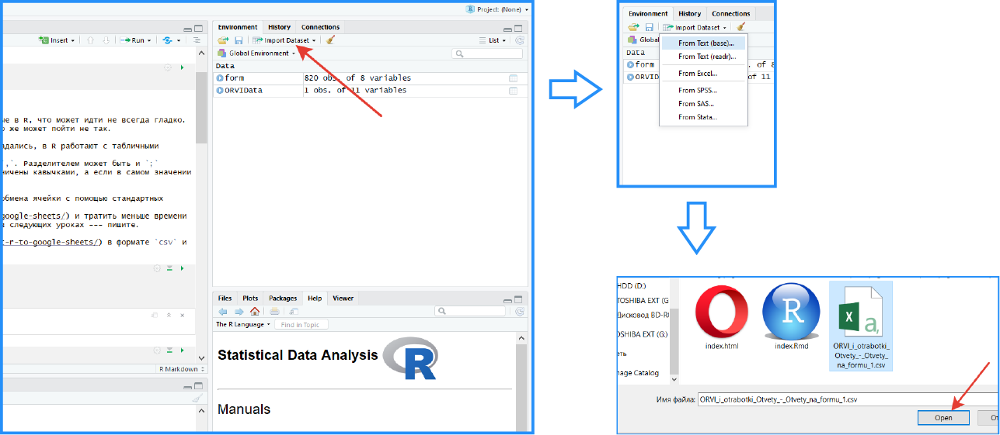
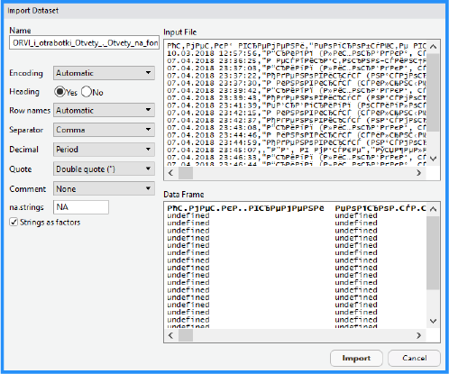
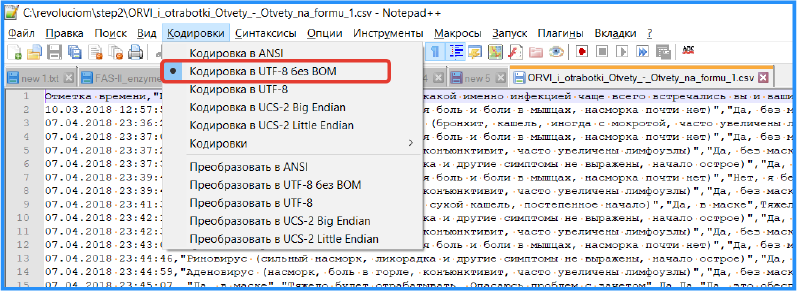
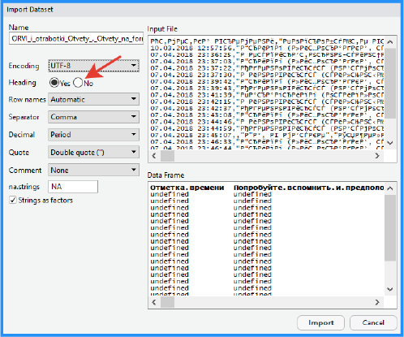
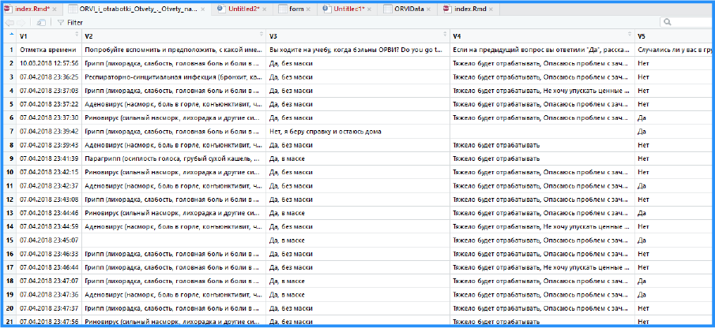
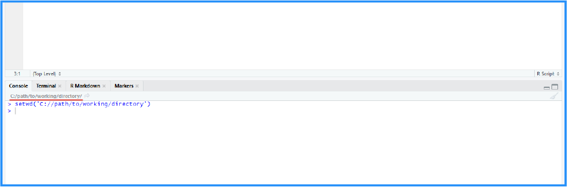
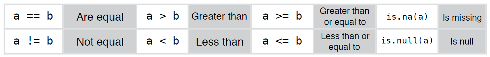

```{r, echo=FALSE}
htmltools::img(src = knitr::image_uri(file.path("ciom_logo.png")), 
               alt = 'logo', 
               style = 'position:absolute; top:0; right:0; padding:10px; width:20%')
```

---

```{r setup, include=FALSE}
knitr::opts_chunk$set(echo = TRUE)
```

```{r load_library, echo=FALSE, warning=F, error=FALSE, message=F,cache=F}
library(data.table)
```
## Начинаем кормить R данными

В первом уроке мы уже обращались к датасету, однако он был встроен в R. Теперь же нужно научиться загружать свои данные в R, что может идти не всегда гладко. Поэтому Таня достала мне свой датасет, с использованием которого возникали проблемы, и мы постараемся разобраться, что же может пойти не так.

Для начала разберемся, какие вообще данные ест R и что они из себя представляют. Во-первых, как вы уже, наверное, догадались, в R работают с табличными данными. Но вот храниться они могут в разных видах файлов.  
**CSV** (*Comma-Separated Values*) --- текст, где каждая строка является строкой таблицы, а колонки делятся символом `,`. Разделителем может быть и `;` (например, Excel при сохранении csv использует точки с запятой). Значения в таком файле могут быть дополнительно ограничены кавычками, а если в самом значении есть запятая (десятичные числа или предложения с запятыми), то его ограничение кавычками обязательно.  
**TSV** (*Tab Separated Values*) --- то же самое, только значения делятся табуляцией.  
Открыть таблицу в формате Excel (xls, xlsx) можно с помощью пакета `readxl`, или импортировать скопированные в буфер обмена ячейки с помощью стандартных средств.  
**Google Sheets** --- тоже можно [подключить к R](https://www.r-bloggers.com/how-to-use-googlesheets-to-connect-r-to-google-sheets/) и тратить меньше времени на загрузку данных. Соответственно с гугл формами та же история. Если есть желание, то можем разобрать такой вариант в следующих уроках --- пишите.  

Итак, мы имеем [датасет с ответами про ОРВИ и отработки](ORVI_i_otrabotki_Otvety_-_Otvety_na_formu_1.csv) в формате `csv` и хотим загрузить его в R. Самый понятный, "юзер-френдли", способ: импорт через интерфейс RStudio. Все, что нужно: нажать кнопку `Import Dataset`, которая находится в окне `Environment` и выбрать `From Text` (поскольку `csv`, хотя и хранит табличные данные, является текстовым файлом). Осталось только найти файл, и ткнуть в него.  

  
<br/>

Все было просто. По крайней мере --- до этого момента. Теперь мы видим превью нашего датасета: не знаю, как у вас, но у меня там краказябра.  

  
<br/>

Что делать? Узнать кодировку файла и указать такую же. Чтобы посмотреть кодировку я воспользуюсь необычным блокнотом `Notepad++`, который вам настоятельно рекомендую установить (это не реклама, он бесплатный). 

  
<br/>

Как мы видим, текст закодирован в `UTF-8 без BOM`, и это означает, что в окошке `Encoding` нужно выставить `UTF-8`. В других вариантах, действуя аналогичным образом, вы сможете загрузить файл в любой кодировке. И этому не учат на курсах R!  

Но и это еще не все, все значения почему-то `undefined`. Методом танца с бубном (гугл не помог) я выяснил, что первая строка, задающая по умолчанию названия колонок, какая-то мутная, и все проблемы из-за неё. Да и неудобно это: использовать вопросы анкеты как названия столбцов. Названия столбцов, как и вообще все переменные в R, должны быть максимально короткими и понятными. Так хотя бы вы сами сможете вспомнить через некоторое время, что они значат.  
Чтобы первая строка не задавала названия колонок, в параметре `Heading` нужно выбрать `No`.  

  
<br/>

Теперь вы можете клацнуть `Import`, датасет появится в `Environment` и перед вами откроется окошко с ним:  

  
<br/>

Описанный способ импорта файлов действительно прост, не требует дополнительных знаний и имеет право на жизнь. Но я считаю предпочтительным прописывать весь импорт в коде. Так вам самим не придется каждый раз импортировать файл, когда вы будете возобновлять работу над каким-то датасетом. И, конечно же, не придется объяснять, какой файл и как импортировать, если вы кому-то скинете свой код. А если в работе использовались несколько файлов в разных кодировках? То-то же. Поэтому будем кодить.

Но сначала нужно выставить `рабочую директорию`. Это папка на вашем компьютере, из которой R будет подхватывать файлы. Рекомендую для работы над отдельным проектом создавать свою папку, в которой будут исходные файлы, и туда же сохранять графики и код. Итак, прошу вас сделать такую для этого урока (не забывайте называть нормально, а не `Новая папка`) и положить туда [датасет, который я давал вначале.](https://www.r-bloggers.com/how-to-use-googlesheets-to-connect-r-to-google-sheets/) Теперь, чтобы сделать папку `рабочей директорией`, нужно написать и выполнить следующий код:

```{r }
setwd('C://path/to/working/directory')
```

В верхней части консоли должен появиться выбранный вами путь. Именно здесь вы можете посмотреть, где сейчас находитесь. Если нажмете стрелочку справа от него, ваша папка откроется в R в нижнем правом окне.

 
`<br/>

Опять же, все это можно сделать и через оболочку: `Session`>`Set Working Directory`>`Choose Directory`.  

Осталось воспользоваться функцией для чтения файлов. Обычно используются стандартные `read.csv()` или `read.tabe()`, но в этот раз мы попробуем `fread` пакета `data.table`. Почему именно его? Только `fread()` смог корректно загрузить наш датасет. Кроме того, [он читает файлы как минимум в 10 раз быстрее чем `read.table`.](https://stepik.org/lesson/28807/step/3?unit=9858) Поэтому прошу вас установить пакет `data.table`. Если забыли как это делается, взгляните на прошлый урок или посмотрите шпаргалку `Base R`, которую вы можете найти [на официальном сайте RStudio](https://www.rstudio.com/resources/cheatsheets/). Функция `fread` имеет много аргументов, но все указывать не обязательно. Подробнее о них и о функции в целом можно прочитать, попросив помощи у R: выполнить команду `help(fread)` или набрав `fread` в окне `Help`.  
Первый и главный аргумент функции `read.csv` --- это `file`. В него мы напишем название нашего файла *в кавычках*: `"ORVI_i_otrabotki_Otvety_-_Otvety_na_formu_1.csv"`. Аргумент должен быть отделен запятой, поэтому ставим её и пишем следующий: `header`, которому присваиваем значение `FALSE`, эквивалентное `F`: смотрите как вам удобнее. Так столбцам не будут присваиваться имена из нашей таблицы. Осталось прописать еще один аргумент: `skip`, отвечающий за число строк, начиная сверху, которые не нужно загружать. Ему мы присвоим значение `1`, чтобы пропустить строку с заголовками. Осталось указать кодировку: попробуйте найти аргумент, отвечающий за неё, сами, указав его значение `"UTF-8"`. В RStudio имеется функция автодополнения кода, поэтому если вы нажмете `Tab` введя очередной аргумент и поставив запятую, то увидите полный список доступных аргументов. Вызов полученной функции позволит корректно прочитать файл, но данные будут выведены в консоль. Поэтому создадим переменную, в которую будут загружены эти данные, например --- `ORVIData`.
<details>
<summary>Сначала попробуйте сами, в итоге должно получиться так</summary>
```{r }
ORVIData <- fread("ORVI_i_otrabotki_Otvety_-_Otvety_na_formu_1.csv", header = F, skip = 1, encoding = "UTF-8", na.strings = "")
head(ORVIData, n = 1)
```
</details>

Вот и все: датасет здесь, и может быть быстро загружен вновь, если выполнить написанный вами код, устанавливающий рабочую директорию и импортирующий файл.

## Немного отполируем наш датасет
Как вы помните, мы сами выкинули названия колонок, и теперь они называются `V1`, `V2` и так далее. Давайте назовем их нормально: для этого есть функция `colnames()`, которая ожидает в качестве аргумента датасет. Чтобы вы четко понимали, что происходит, давайте выполним её в таком виде.
```{r }
colnames(ORVIData)
```
Как вы видите, функция вытянула из датасета названия колонок. Нам же нужно записать вместо них свой список значений, которые и станут названиями колонок. Давайте его создадим:
```{r }
ORVIDataColumns <- c("TimeStamp", "YourFrequentURI", "VisitingUniversityDuringInfection", "WhyVisiting", "OutbreaksInYourGroup", "InfectedBySickGroupmate", "NeedLightDutyForIllStudents", "WhatTreatment")
```

То же самое можно проворачивать с именами строк, только вместо `colnames()` будет `rownames()`. Также здесь я использовал функцию `c()`, которая объединяет значения в вектор. Короче говоря, создает список из поданных в неё аргументов. Ну в общем, вы поняли: это очень важная функция.  
Теперь как в том клипе про ручку, ананасы и все-такое: берем названия колонок из `ORVIData` и присваиваем им наш вектор `ORVIDataColumns`:

```{r }
colnames(ORVIData) <- ORVIDataColumns
```

Если магия сработала, названия колонок должны прийти в божеский вид.  

Осталось разобраться с еще одной маленькой проблемой. Вы можете сказать, что её нет, так как речь идет о пропущенных значениях. Если внимательно посмотреть на датасет, то они там встречаются. Фактически, это пустые строки, то есть `""`, которые нужно заменить на `NA`, использующиеся в R для обозначения пропущенных значений. Для этого нужно выбрать эти значения и присвоить им `NA`. Вот тут-то мы и познакомимся с выбором значений.  
Давайте подробнее опишем нашу проблему для R (по типу истории с холодильником и жирафом, по другому он не поймет):
1. Возьми датасет `ORVIData`.
2. Возьми в датасете `ORVIData` ячейки, равные `""`.
3. Присвой им `NA`.
Если перенести это на родной язык R, то выглядеть будет так:
```{r }
ORVIData[ORVIData==""] <- NA
```
Ну в целом, тут все понятно. Хотя это сейчас мне понятно, но поначалу я тоже не мог вкурить, зачем в квадратных скобках нужно снова обращаться к датасету, я же к нему и так обращаюсь? Да, это стандартный синтаксис R, и он весьма нагроможденный, но мы *должны* с ним познакомиться. Есть пакеты, которые опускают излишества в коде типа того, который я описал, облегчающие написание и чтение кода. Таким пакетом является, например, установленный вами `data.table`.  
Также здесь использовался оператор `==`, проверяющий равны ли объекты. Это тоже важный момент: для присваивания может использоваться `=`, а для сравнения --- только два знака равенства. Это стандартная вещь в программировании. Остальные операторы сравнения вы можете посмотреть в шпаргалке `Base R`, но на всякий случай, вот они:  

 

## Кстати, тут есть адовые типы данных

R --- объектно-ориентированный язык программирования, заточенный под работу с таблицами. Соответственно, здесь есть общепринятые типы данных, например числовые (`numeric`), строковые (`character`), логические, или булевые (`logical`) --- содержащие значения `TRUE` или `FALSE`, векторы, факторы, а также различные таблицы: датафреймы (`dataframe`), матрицы (`matrix`) и так далее. Чтобы узнать тип данных какого-либо объекта, можно использовать функцию `class()'. Давайте посмотрим, из чего сделан наш `ORVIData`:
```{r }
class(ORVIData)
```
Наш датасет имеет тип `data.frame`/`data.table`, чего и следовало ожидать. По сути датафрейм является списком, содержащих списки различных типов. Попробуйте узнать тип какого-нибудь столбца. Обращаться к столбцу можно с помощью доллара (`$`), как было описано в предыдущем уроке. Ответ без кавычек нужно записать в форму с ответами по уроку, которая будет ниже.

## Нет привета без сабсета

Обращение к данным с помощью стандартного синтаксиса, как вы догадываетесь, происходит посредством квадратных скобок. в них можно выбрать нужные строки и колонки:
```{r }
ORVIData[50,6]
```
Здесь было выбрано значение шестой колонки в пятидесятой строке. То есть в квадратных скобках первая цифра --- строка, вторая (после запятой) --- столбец. Это нужно запомнить.  
Так как наши колонки имеют свои названия, обратиться можно не по порядковому номеру колонки, но и с помощью названия:
```{r }
ORVIData[50,InfectedBySickGroupmate]
```

Теперь представим, что нам понадобилось выдернуть из датасета всех людей, которых никогда не заражали одногруппники. Второе значение в квадратных скобках оставляем пустым, так как нам нужны все столбцы, а не какой-то конкретный:
```{r eval=FALSE}
ORVIData[InfectedBySickGroupmate=="Нет",]
```
Нагромождения кода набирают все большие обороты. Однако в стандартном синтаксисе для сабсета предусмотрена функция `subset()`, которая немного упрощает жизнь:
```{r eval=FALSE}
subset(ORVIData, InfectedBySickGroupmate == "Нет", 5)
```
Первый аргумент, `x` --- наш датасет; второй, `subset`, --- условие для строк, которые мы хотим выбрать; третий, `select` --- столбцы, которые мы хотим выбрать. Названия аргументов указывать необязательно, если вы указываете их значения в том же порядке, в котором идут аргументы. По сути мы выбрали то же самое, но взяли только пятый столбец.

## Сделал дело --- сохраняйся
Когда вы хорошо поработали в R, помимо предобработанного датасета могут появиться побочные объекты, которые хотелось бы сохранить, чтобы не создавать по-новой в следующей сессии. Для этого можно сохранить их в формате `File.RData`: просто перечислите объекты в функции `save()` и укажите имя файла в аргумент `file`.
```{r eval=FALSE}
save(ORVIData, file="ORVI.RData")
```

Загрузить данные можно командой `load()`:
```{r eval=FALSE}
load("ORVI.RData")
```

## Задания
1. Первое задание я дал выше: нужно разведать тип данных столбцов датасета по ОРВИ.  
2. Нужно узнать, сколько студентов в датасете берут больничный и не идут на пары, когда заболевают ОРВИ. Здесь вам в помощь будет функция `nrow()`, которая выдает число строк в датасете (соответственно, есть и функция `ncol()`)
3. Теперь я попрошу вас написать скрипт, который отсеивает из датасета наблюдения (строки), в которых имеются пропущенные значения. Загрузите его в форму.
4. Выберите из датасета редисок: людей, которые были когда-то заражены одногруппниками, но сами в случае болезни все равно ходят в университет без маски. Здесь мне следует упомянуть оператор `&` который поможет выбрать строки, которые объединяют два этих условия. От вас требуется написать *одну* строку, которая удовлетворяет данное требование.  
5. *Задание похоже на третье: тоже нужно отсеять пропущенные значения, но убирать строки, в которых пропущено только значение в колонке `WhyVisiting` не нужно (так как ответ "Нет" на предыдущий вопрос подразумевает, что на этот отвечать не нужно). Это задание выполнять необязательно, но желательно.*  
[--> Форма для ответов <--](https://docs.google.com/forms/d/e/1FAIpQLSecKaLu01h3x7EJtfILjBdZWYVCtlGy0YPlqoY1D7BVEm0BXg/viewform?usp=sf_link)  

## Как жить с этим дальше?
Советую вам изучать уже рекомендованный мной `Base R` и ориентироваться по нему: я просто физически не могу освещать *всё*. Тогда это уже получится книга, а ссылку на книгу я и так вам могу дать. Настоятельно рекомендую зарегистрироваться на `Stepik` и начать проходить курсы [по основам статистики](https://stepik.org/course/76) и [анализу данных в R](https://stepik.org/course/129). Препод на них, в основном, один и тот же, и объясняет материал классно --- вам понравится.  
<br/>
<br/>
*Если что-то осталось непонятным, не стесняйтесь задавать вопросы в диалоге. Мы ведь для этого и собрались.*